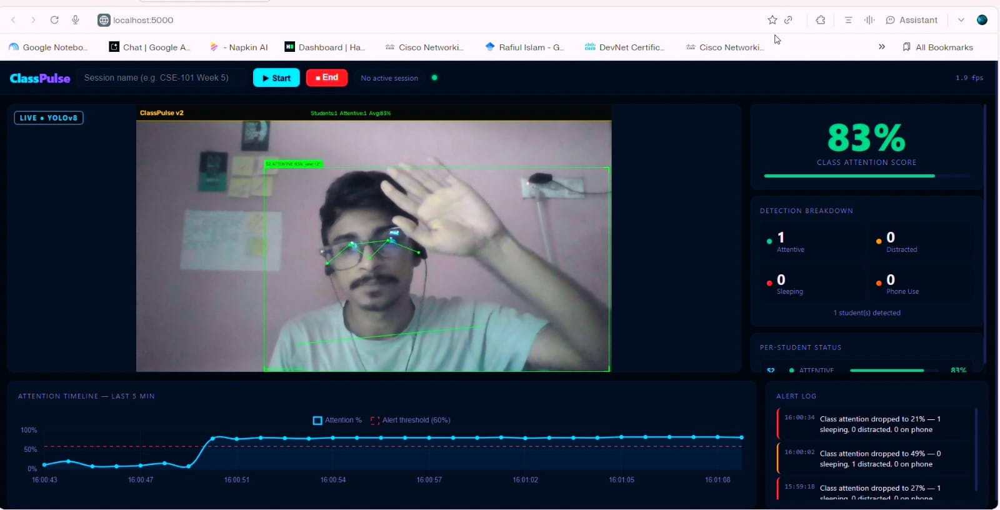
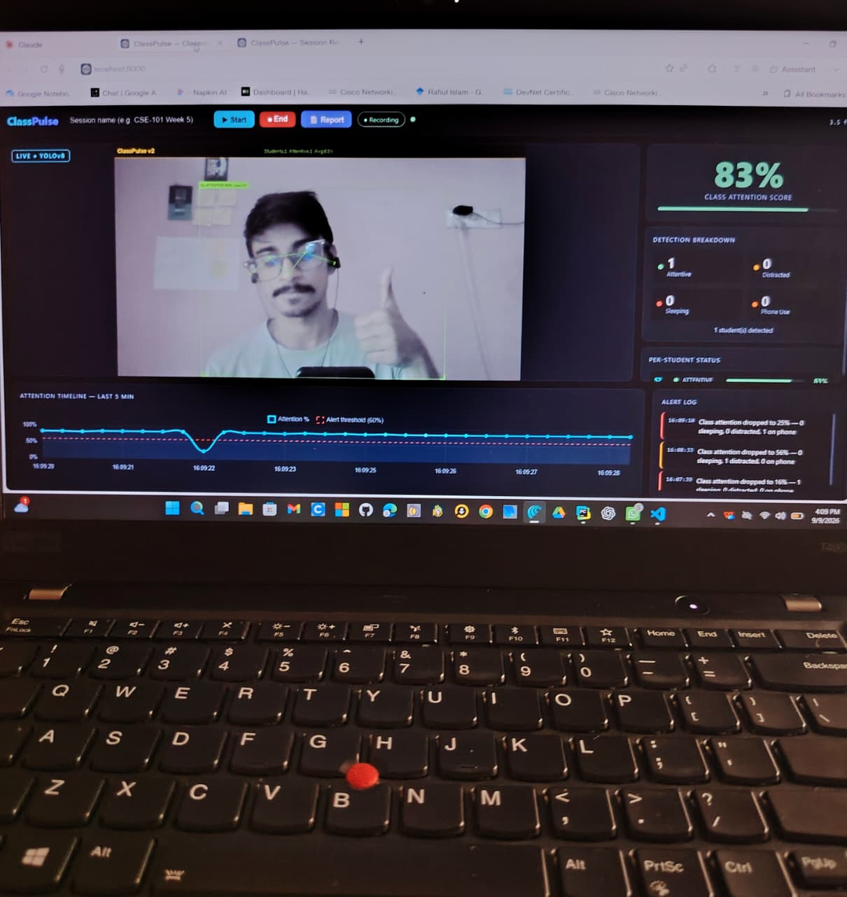
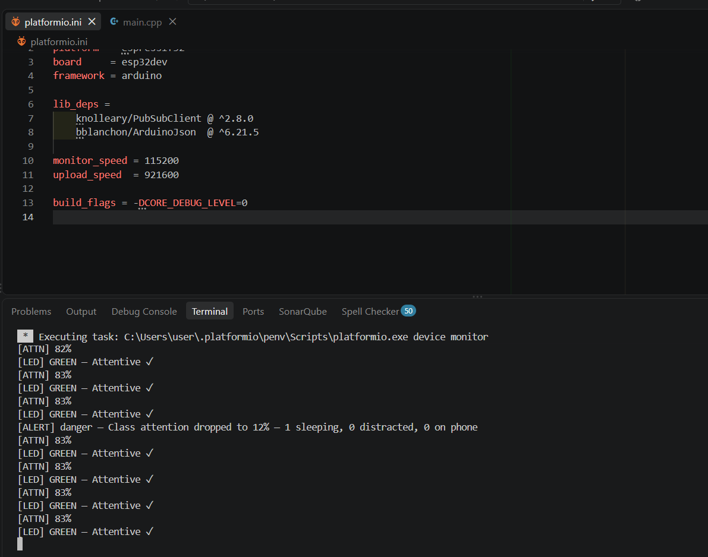
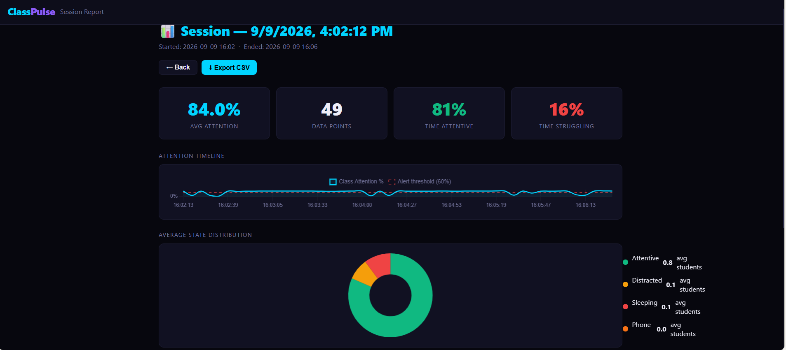
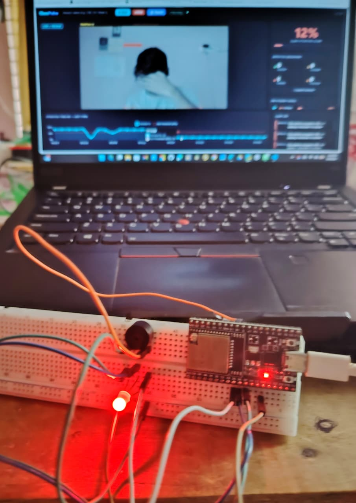
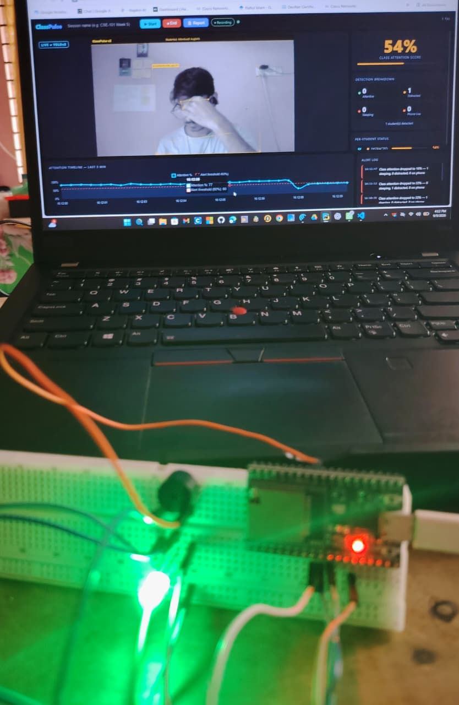

<div align="center">


<br/>

[](https://python.org)
[](https://ultralytics.com)
[](https://flask.palletsprojects.com)
[](https://platformio.org)
[](https://mosquitto.org)
[](https://opencv.org)
[](LICENSE)

<br/>

> **ClassPulse** is an AI-powered real-time classroom attention monitoring system that uses **YOLOv8 Pose Estimation** to detect attentive, distracted, sleeping, and phone-using students — delivering instant feedback through a live web dashboard and **ESP32 IoT hardware alerts**.

</div>

---

## 🎬 Demo

### Live Dashboard


### Detection in Action
<p align="center">
  
  &nbsp;
  
</p>

<p align="center">
  <em>Left: Full detection mode &nbsp;|&nbsp; Right: serial monitor detection</em>
</p>


### Session Report


### 🔌ESP32 Hardware

<p align="center">
  
  &nbsp;
  
</p>

<p align="center">
  <em>Left: Full breadboard wiring &nbsp;|&nbsp; Right: RGB LED closeup</em>
</p>

---

## 📌 Table of Contents

- [Overview](#-overview)
- [Features](#-features)
- [System Architecture](#-system-architecture)
- [Tech Stack](#-tech-stack)
- [Hardware Requirements](#-hardware-requirements)
- [Project Structure](#-project-structure)
- [Getting Started](#-getting-started)
- [Configuration](#-configuration)
- [How It Works](#-how-it-works)
- [MQTT Topics](#-mqtt-topics)
- [ESP32 Behaviour](#-esp32-behaviour)
- [Troubleshooting](#-troubleshooting)
- [Author](#-author)

---

## 🎯 Overview

ClassPulse addresses a real problem in modern education — teachers have no scalable way to know if students are paying attention. This system uses a single webcam, AI pose estimation, and IoT hardware to give teachers instant, data-driven attention feedback without any wearables or student-side hardware.

**What makes it different:**
- No special student hardware — just a camera
- Works with any laptop webcam (GPU supported, CPU fallback)
- Real-time per-student attention scoring using head pose geometry
- Physical IoT feedback — RGB LED + buzzer on teacher's desk
- Session reports with exportable CSV data

---

## ✨ Features

| Feature | Description |
|---|---|
| 🧠 **YOLOv8 Pose** | 17-point skeleton detection per student |
| 📐 **Head Pose Estimation** | Yaw + pitch angle from facial keypoints |
| 👁️ **Eye State Detection** | Closed-eye streak detection for sleeping |
| 📱 **Phone Detection** | YOLOv8n COCO detects cell phones near students |
| 📊 **Live Dashboard** | Flask + Chart.js with MJPEG stream + SSE updates |
| 🔴 **IoT Alerts** | ESP32 → RGB LED colours + passive buzzer tones |
| 🗄️ **Session Logging** | SQLite stores every scan with timestamps |
| 📄 **Report Generation** | Per-session HTML report + CSV export |
| 📡 **MQTT Integration** | Mosquitto broker bridges Python ↔ ESP32 |
| 🎯 **Persistent Tracking** | YOLOv8 `.track()` gives each student a stable ID |

---

## 🏗️ System Architecture

```
┌─────────────────────────────────────────────────────────────────┐
│                        ClassPulse System                        │
│                                                                 │
│  [Laptop Camera]                                                │
│       │                                                         │
│       ▼                                                         │
│  ┌─────────────────────────────┐                                │
│  │     detector.py (Thread)    │                                │
│  │  YOLOv8-pose  ──────────── 17 keypoints per student          │
│  │  YOLOv8n      ──────────── phone detection (class 67)        │
│  │  attention.py ──────────── head pose + eye state → score     │
│  └──────────────┬──────────────┘                                │
│                 │                                               │
│          ┌──────┴──────┐                                        │
│          ▼             ▼                                        │
│     database.py    mqtt_handler.py                              │
│     (SQLite)       (Mosquitto)                                  │
│          └──────┬───────┘                                       │
│                 ▼                                               │
│            app.py (Flask)                                       │
│       ┌─────────────────────┐                                   │
│       │  /video_feed MJPEG  │──► Browser Dashboard              │
│       │  /stream  SSE       │──► Live Chart.js updates          │
│       │  /report  HTML      │──► Session report + CSV           │
│       └─────────────────────┘                                   │
│                 │                                               │
│          MQTT Broker                                            │
│                 │                                               │
│          ┌──────▼──────┐                                        │
│          │   ESP32     │                                        │
│          │  RGB LED    │ Green/Blue blink/Red/Purple            │
│          │  Buzzer     │ Tones based on attention level         │
│          └─────────────┘                                        │
└─────────────────────────────────────────────────────────────────┘
```

---

## 🛠️ Tech Stack

| Layer | Library/Tool | Purpose |
|---|---|---|
| Detection | `ultralytics` YOLOv8 | Pose + object detection |
| Vision | `opencv-python` | Camera capture + annotation |
| Web | `flask` | Server, MJPEG, SSE, REST |
| IoT comms | `paho-mqtt` | MQTT publisher |
| Data | `numpy`, `pandas` | Geometry + processing |
| Storage | `SQLite` | Session + log database |
| Frontend | `Chart.js 4.4` | Real-time timeline charts |
| Embedded | `ESP32 + PlatformIO` | IoT feedback node |
| Broker | `Mosquitto` | MQTT message broker |

---

## 🔌 Hardware Requirements

| Component | Qty | Notes |
|---|---|---|
| ESP32 Dev Board | 1 | Any variant |
| RGB LED (4-pin) | 1 | Common Cathode |
| 220Ω Resistors | 3 | One per R/G/B channel |
| Passive Buzzer | 1 | 2-pin, needs PWM |
| Breadboard | 1 | Half-size or larger |
| Jumper Wires | ~15 | Male-to-male |
| USB Cable | 1 | ESP32 power + flash |
| Laptop + Webcam | 1 | Built-in camera works |

**Wiring — RGB LED (Common Cathode):**
```
ESP32 GPIO 25  →  220Ω  →  LED Red pin   (Pin 1)
ESP32 GPIO 26  →  220Ω  →  LED Green pin (Pin 3)
ESP32 GPIO 27  →  220Ω  →  LED Blue pin  (Pin 4)
LED Common GND (Pin 2, longest leg)  →  GND rail
```

**Wiring — Passive Buzzer:**
```
ESP32 GPIO 18  →  Buzzer + leg
GND rail       →  Buzzer − leg
```

> **How to wire a resistor:** GPIO pin → resistor leg 1 → resistor leg 2 → LED colour pin. The resistor sits between GPIO and LED on the same breadboard row.

---

## 📁 Project Structure

```
ClassPulse/
├── app.py                  # Flask entry point — run this
├── detector.py             # YOLOv8 background detection thread
├── attention.py            # Head pose + eye state → score
├── database.py             # SQLite session & log manager
├── mqtt_handler.py         # MQTT publisher
├── config.py               # All settings in one place
├── requirements.txt
│
├── templates/
│   ├── index.html          # Live dashboard UI
│   └── report.html         # Session report with charts
│
├── static/
│   ├── css/style.css       # Dark cyberpunk design system
│   └── js/dashboard.js     # SSE listener + Chart.js
│
├── esp32/
│   └── platformio_project/
│       ├── platformio.ini
│       └── src/main.cpp    # ESP32 firmware
│
├── assets/                 # Screenshots for this README
│   ├── dashboard.png
│   ├── detection.png
│   ├── report.png
│   └── hardware.jpg
│
├── sessions/               # Auto-created — SQLite DB
├── reports/                # Auto-created — CSV exports
├── .gitignore
└── README.md
```

---

## 🚀 Getting Started

### 1. Clone

```bash
git clone https://github.com/rafiul254/ClassPulse.git
cd ClassPulse
```

### 2. Install Python dependencies

```bash
pip install -r requirements.txt
```

> YOLOv8 models download automatically on first run (~20 MB).

### 3. Start Mosquitto broker

```bash
# Windows (run as Administrator)
net start mosquitto
```

Open `C:\Program Files\mosquitto\mosquitto.conf` and ensure:
```
listener 1883
allow_anonymous true
```

Allow port 1883 through Windows Firewall:
```bash
netsh advfirewall firewall add rule name="Mosquitto MQTT" dir=in action=allow protocol=TCP localport=1883
```

### 4. Configure ESP32

Open `esp32/platformio_project/src/main.cpp`, edit the config block:
```cpp
#define WIFI_SSID      "YourWiFiName"     // must be 2.4 GHz
#define WIFI_PASSWORD  "YourPassword"
#define MQTT_BROKER    "192.168.X.X"      // your PC's IP (ipconfig)
```

Build and upload via VS Code PlatformIO: **✓ Build → → Upload**

### 5. Run

```bash
python app.py
```

Open: **http://localhost:5000**

---

## ⚙️ Configuration

All tuning constants live in `config.py`:

```python
CONF_THRESHOLD      = 0.50   # keypoint confidence gate
YAW_DISTRACTED_DEG  = 25     # head turn → DISTRACTED
YAW_AWAY_DEG        = 50     # head turn → fully sideways
PITCH_SLEEPING_DEG  = 30     # chin drop → SLEEPING
EAR_CLOSED_FRAMES   = 8      # consecutive closed-eye frames → SLEEPING
ATTENTION_THRESHOLD = 60     # class avg below this → alert fires
ALERT_COOLDOWN      = 30     # seconds between repeat alerts
```

---

## 🧠 How It Works

### Attention Scoring

```
Camera quality gate → max face conf < 22% → UNCERTAIN (score 10)

Head yaw (left-right):
  |yaw| < 25°  → +45 pts  (camera-facing)
  |yaw| < 50°  → +20 pts  (partial turn)
  |yaw| ≥ 50°  →  +0 pts  (sideways)

Head pitch (down):
  pitch < -30° → cap at 12 (sleeping)

Eye state:
  Open         → +20 pts
  Closed ≥ 8 frames → cap at 12 (SLEEPING)

Confidence scaling:
  avg_conf [0.35→1.0] → scale [0.5→1.0]

Phone nearby → hard cap at 25, state = PHONE
```

### State Classification

| Score | State |
|---|---|
| 65–100 | 🟢 ATTENTIVE |
| 30–64 | 🟡 DISTRACTED |
| 0–29 | 🔴 SLEEPING |
| any | 📱 PHONE |
| any | ⚪ UNCERTAIN |

---

## 📡 MQTT Topics

| Topic | Payload |
|---|---|
| `classpulse/stats` | `{"class_attention": 72, "total_students": 5, ...}` |
| `classpulse/alert` | `{"level": "danger", "message": "Attention dropped..."}` |

**Test manually:**
```bash
mosquitto_pub -h localhost -t "classpulse/stats" -m "{\"class_attention\":85}"
mosquitto_pub -h localhost -t "classpulse/alert" -m "{\"level\":\"danger\",\"message\":\"Test\"}"
```

---

## 💡 ESP32 Behaviour

| State | RGB LED | Buzzer |
|---|---|---|
| Boot | White sweep → R → G → B | C-E-G-C melody |
| WiFi connecting | Yellow blink | — |
| MQTT connected | Cyan double flash | Double beep |
| Attention ≥ 70% | 🟢 Solid Green | Silent |
| Attention 45–69% | 🔵 Blue blink | Silent |
| Attention < 45% | 🔴 Solid Red | Warn beep |
| Alert warning | 💜 Purple ×2 | Double warn |
| Alert danger | 💜 Purple ×4 | Triple alarm |

---

## 🔧 Troubleshooting

| Problem | Fix |
|---|---|
| Camera not found | Change `CAMERA_INDEX = 1` in `config.py` |
| MQTT `rc=-2` | Open port 1883 in Windows Firewall |
| ESP32 won't connect | WiFi must be **2.4 GHz** — ESP32 doesn't support 5 GHz |
| Score always high | Lower `MIN_FACE_CONF` in `attention.py` |
| Too many false SLEEPING | Increase `EAR_CLOSED_FRAMES` to 12+ |

---

## 📝 Medium Article

Full technical deep-dive on Medium:
**[ClassPulse: I Built an AI That Detects If Students Are Sleeping in Class](https://rafiulislam25.medium.com/classpulse-i-built-an-ai-power-system-that-detects-if-students-are-sleeping-in-class-6cba2f8d9c5c?sharedUserId=rafiulislam25)**

---

## 👨‍💻 Author

<div align="center">

**Rafiul Islam**

B.Sc. in IoT & Robotics Engineering — University of Frontier Technology, Bangladesh

[](https://youtube.com/@PinToCloud)
[](https://github.com/rafiul254)
[](https://linkedin.com/in/rafiul-islam-25sep92004)
[](https://medium.com/@rafiulislam25)

</div>

---

<div align="center">

**Built with using YOLOv8 + Flask + ESP32**

*If this project helped you, please give it a ⭐*


</div>
